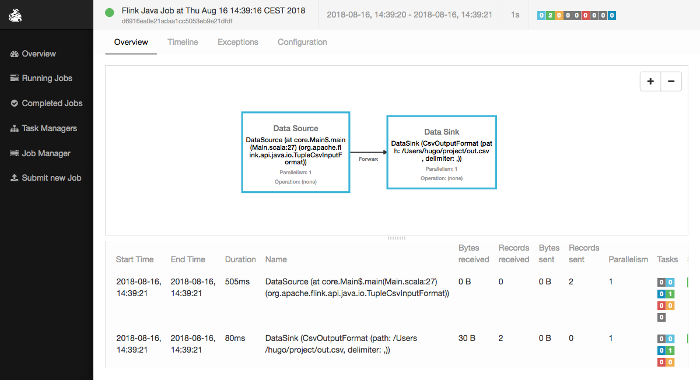

Getting started
===============

Dependencies
------------

The project makes use of the Apache Flink stream and batch processing framework.
Flink needs a working **Java 8.x** installation to run and is compatible with Windows,
Linux and MacOS. The code is compatible with **Flink 1.5 and above**.

Apache Flink can be installed by downloading and extracting a binary from `here <https://flink.apache.org/downloads.html>`_.

Or you can install it with a package manager of your choice (e.g. Homebrew on MacOS), 
a more detailed description `there <https://ci.apache.org/projects/flink/flink-docs-release-1.6/quickstart/setup_quickstart.html>`_.

In order to run the code, **Scala 2.12.x** and **sbt** should also be installed 
(`details <https://www.scala-sbt.org/download.html>`_).

Finally, the compiler is compatible with Python3.6 and above. You can install the 
dependencies with ``pip install -r requirements.txt`` from the main directory.

------------ 

The data journalism extractor has several modules that are based on different softwares. The 
MongoDB Importer module needs a working MongoDB installation in order to work.

To run the example, one will need working Postgres and MongoDB installations.

Installation
------------

Get the project from GitHub
^^^^^^^^^^^^^^^^^^^^^^^^^^^

The project can be downloaded from the GitHub repository with the command

``git clone git@github.com:hugcis/data_journalism_extractor.git your/path/``

then run ``cd your/path/`` to get started.

How to run a program
^^^^^^^^^^^^^^^^^^^^

The Flink program that will execute some operations lives in the ``scala/src/main/scala/core`` 
directory, along with all the modules and classes used to run operations. 
The main template is ``MainTemplate.scala.template``. It will be rendered with code corresponding
to some specifications from a JSON file. 

Specifications come in the following JSON structure: 

.. code-block:: javascript

   {
       modules: [
           {
               moduleType: "string",
               name: "string", 
               ...
           },
           {
               moduleType: "string",
               name: "string", 
               ...
           },
           ...
       ]
   }

This defines a **directed acyclic graph** (DAG) of operations, where outputs of
some modules can be fed to inputs of other modules. 

The JSON files defines a program, that can be compiled with a python script as follow:

``python/compile.py -s spec.json``

A more complete description of the available options and functioning of the script can 
be obtained by running ``python/compile.py -h``.

Once the DAG has been compiled, the generated Scala program can in turn be compiled 
and packaged into a JAR to run on a Flink cluster (either locally or on a cluster).

Minimal Example
^^^^^^^^^^^^^^^

Take the following simple program:

.. code-block:: javascript

   {
       "modules": [
           {
               "moduleType": "csvImporter",
               "name": "In", 
               "path": "~/project/in.csv",
               "dataType": ["String", "String"]
           },
           {
               "moduleType": "csvOutput",
               "name": "Out", 
               "path": "~/project/out.csv",
               "source": "In"
           }
       ]
   }

This defines a program that will copy a CSV file with two inputs called ``in.csv`` and paste it 
in an other file called ``out.csv``. The corresponding DAG looks like this:

.. image:: images/mini_ex.*

It was generated by compiling the above JSON file with ``python/compile.py -s spec.json -p``. The 
flag ``-p`` is used to generate a DAG representatin of your program in PDF format.

The following lines of Scala code were generated during compilation

.. code-block:: scala
   
    // set up the execution environment
    val env = ExecutionEnvironment.getExecutionEnvironment
    
    // ===== CSV Importer module In =====
    
    val filePath_In = "~/project/in.csv"
    val lineDelimiter_In = "\n"
    val fieldDelimiter_In = ","
    val In = env.readCsvFile[(String, String)](filePath_In, lineDelimiter_In, fieldDelimiter_In)
    
    // ===== CSV Output File Out =====
    
    val filePath_Out = "~/project/out.csv"
    In.writeAsCsv(filePath_Out, writeMode=FileSystem.WriteMode.OVERWRITE)

    // ===== Execution =====

    env.execute()

To make Flink run the program, you need to pack your code into a .jar file with ``sbt clean assembly``
from the ``scala`` directory.

Next, make sure you have a Flink task manager running, for example locally 
(see `link <https://ci.apache.org/projects/flink/flink-docs-release-1.6/quickstart/setup_quickstart.html#start-a-local-flink-cluster>`_).
You should be able to see the Flink web interface at http://localhost:8081.

You can then run your program with ``flink run target/scala-2.11/test-assembly-0.1-SNAPSHOT.jar``
(the exact name of the file depends on the parameters set in ``build.sbt``).

You should the be able to see ``out.csv`` in ``~/project`` and the following job in your Flink
web interface:

